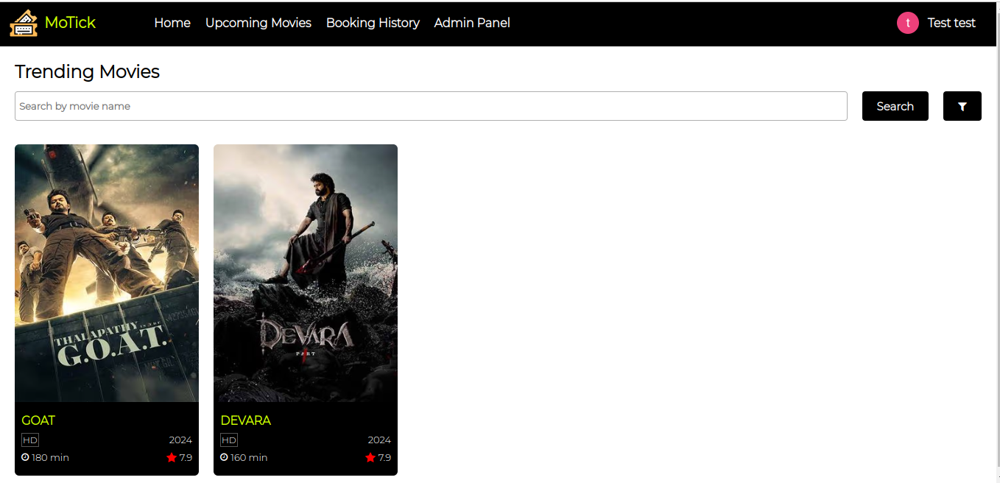
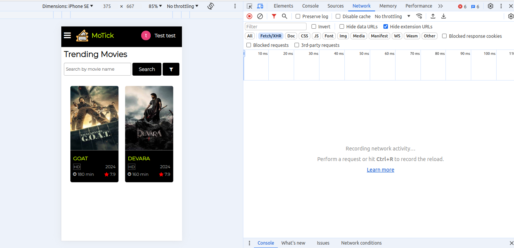
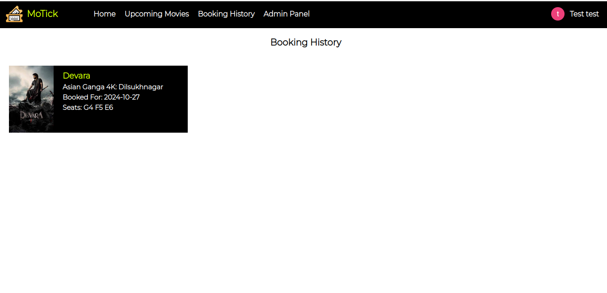
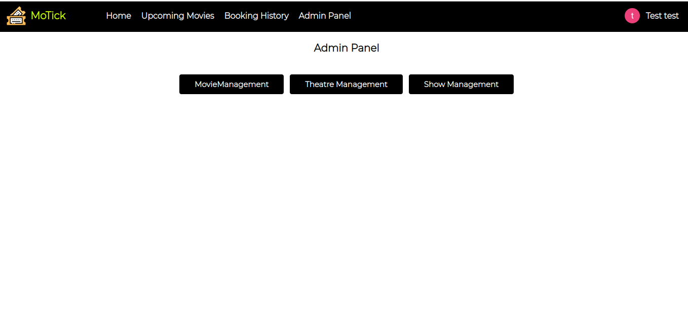
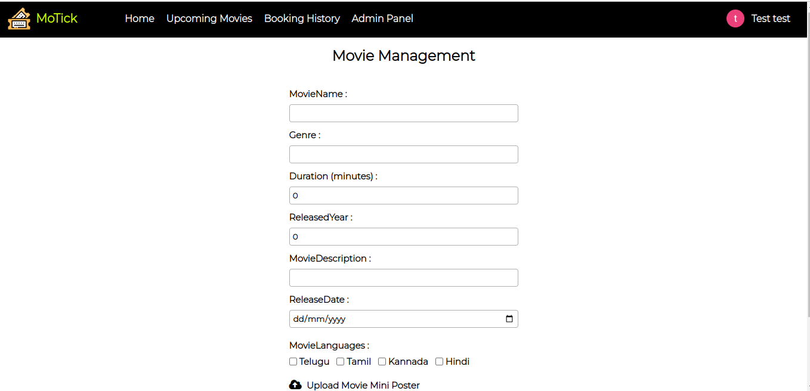
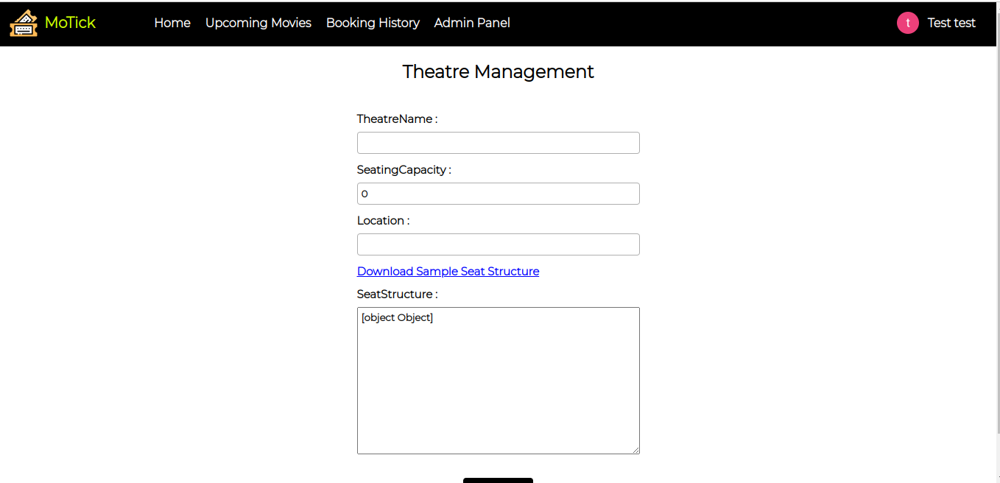
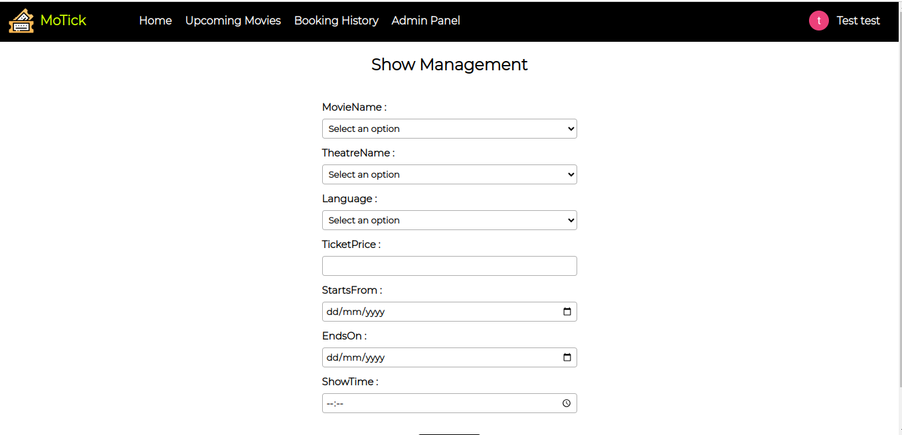
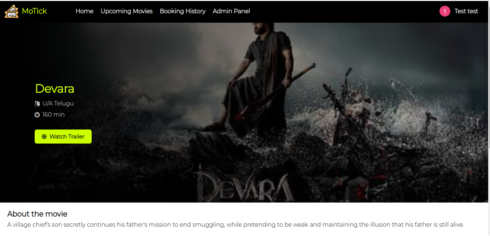
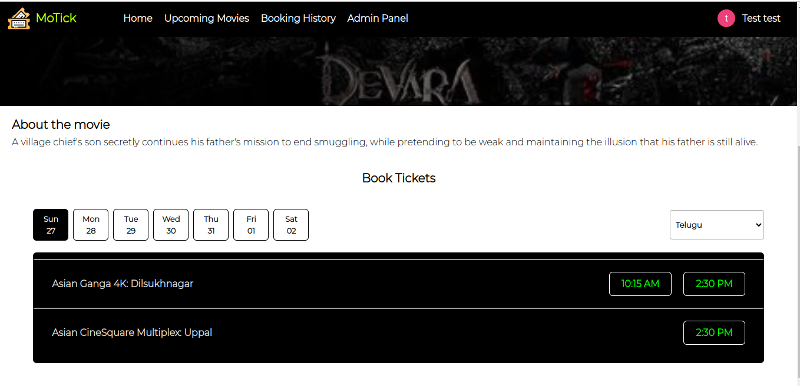
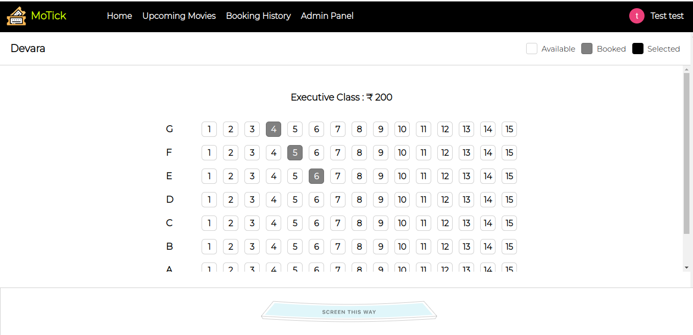

<h1>MoTick(movie ticket management)(React+Vite)</h1>
<h2>Installation process</h2>

Run <b>npm install or npm install --legacy-peer-deps</b>
 

Now run <b>npm run dev</b>, then webapp will automatically open
    
<h2>Implemented functionalities</h2>
<ul>
    <li>Search functionality</li>
    <li>Admin panel added</li>
    <li>User booking history maintained</li>
    <li>Movie Management,Theatre Management,Show Management added in Admin panel</li>
    <li>Seat Booking pages added and the respective data is maintained in db</li>
    <li>Google login and signup implemented</li>    
    <li>Routing is implemented throughout the application.</li>
    <li>Authentication added by validating token.Added interceptors for passing the token for every request.</li>
    <li>Token expiry added for security purpose</li>
    <li>Responsiveness added</li>
</ul>    
<h1>Pages</h1>
<h2>Home page</h2>

<h2>Home(mobile view)</h2>

<h2>Booking History</h2>

<h2>Admin Panel</h2>

<h2>Movie Management</h2>

<h2>Theatre Management</h2>

<h2>Show Management</h2>

<h2>Main Movie Screen</h2>

<h2>Theatres List</h2>

<h2>Seat Booking</h2>

